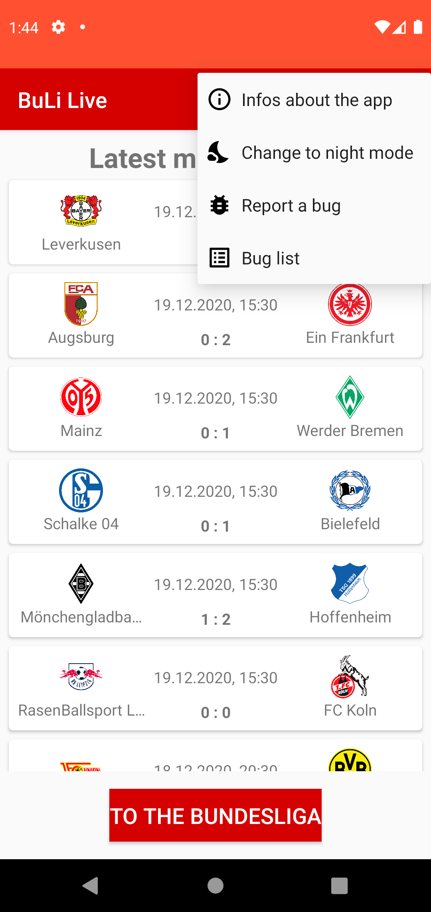
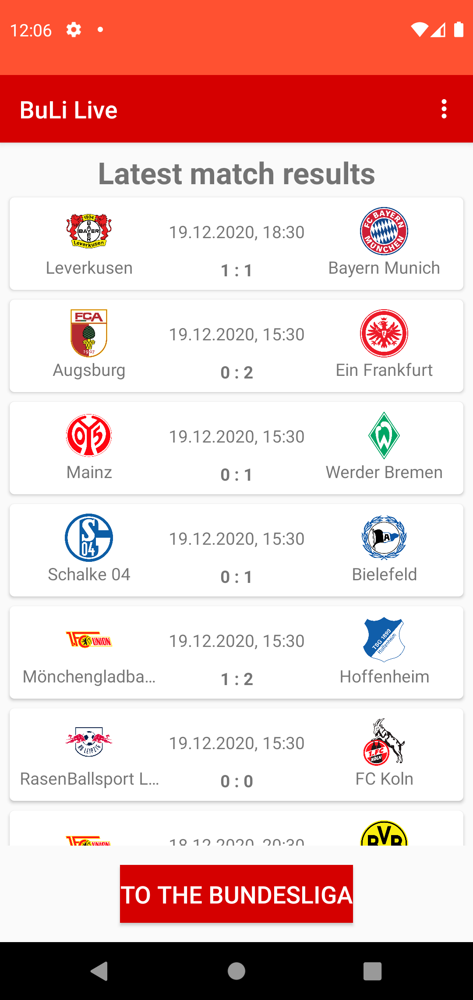
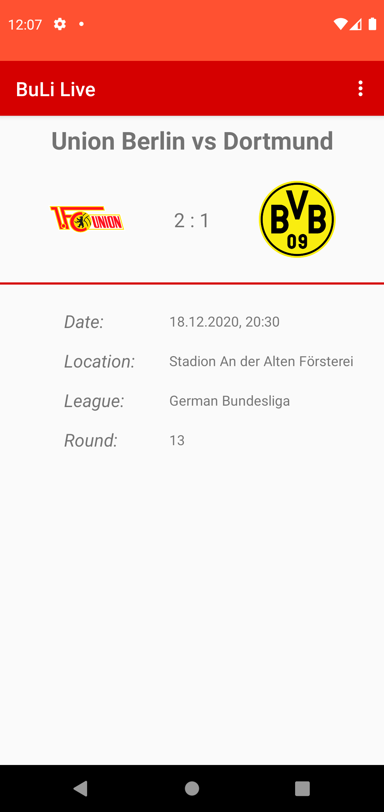
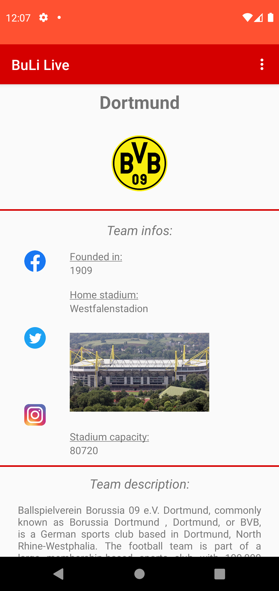
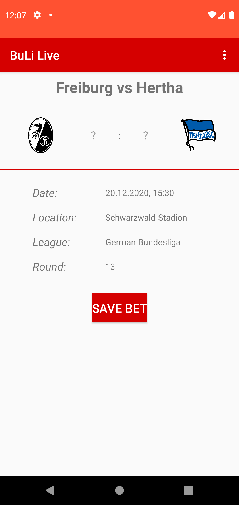
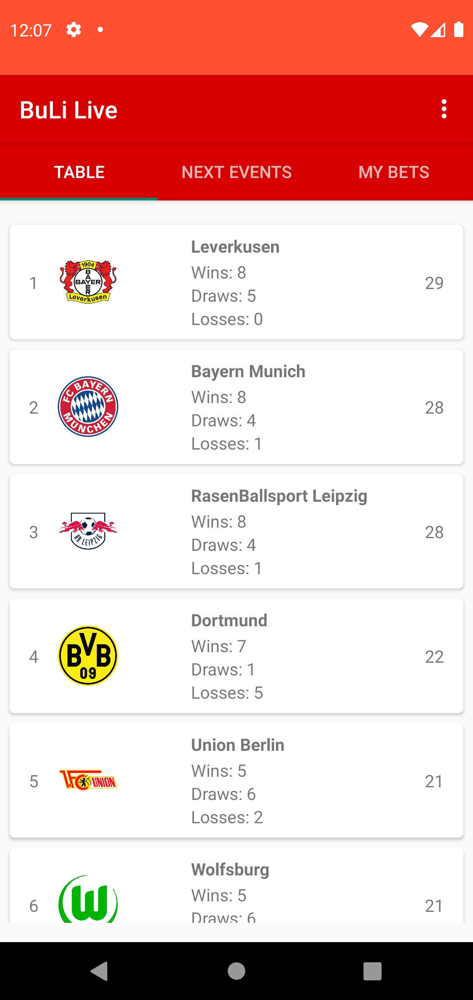
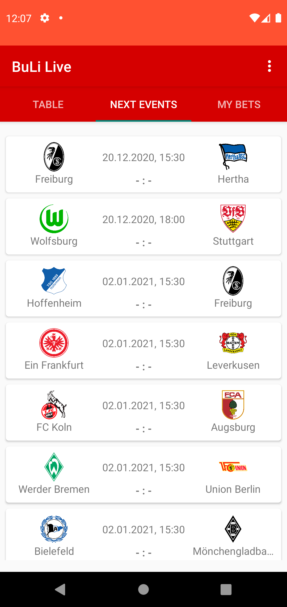
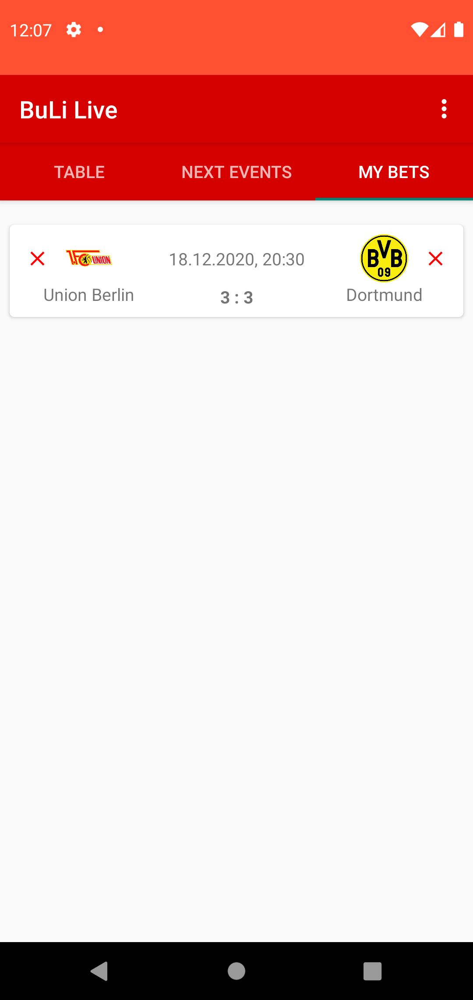

# BuLi Live

An Android-app to show information about the german Bundesliga. Data is aquired through the [thesportsdb](thesportsdb.com)-API.

## Features

The app can show information about:
- a specific team of the Bundesliga
- an event of the Bundesliga (from the past and future)
- the current table positions of the teams

In addition to only showing basic information it is possible to save bets for games in the future. The bet will then later be validated against the match result and the status will be shown to the user.

## Activities

|         | BaseActivity | MainActivity | EventActivity |
| ------- | ------------ | ------------ | ------------- |
| Author  | Tim-Loris Deinert | Andre Bautz | Jan Stippe |
| Preview |  |  |  |
| Description | This activity is used as a base for all other activities. It adds an options menu to change the app theme or report bugs. | Activity shows the last events of the Bundesliga in a RecyclerView. EventAdapter is used for the RecyclerView as well as the item_event.xml-layout for the items. A click on an item in the list will start the EventActivity with the event's id as an extra. The Button allows to start the OverviewVActivity. | Activity shows more detailed information about an event (e. g. location, time, round...). A click on the team badges will start the TeamActivity. The id of the team is given as an extra. |

|         | TeamActivity | BetActivity | OverviewActivity |
| ------- | ------------ | ----------- | ---------------- |
| Author  | Tim-Loris Deinert | Jan Stippe | Jan Stippe   |
| Preview |  |  |  |
| Description | Activity shows details about a specific team. Social Media links are shown as well as general information and a description about the team. | Activity shows more detailed information about an event (e. g. location, time, round...). In addition it is possible to save a bet for the event. A POJO will be created and saved to a list. The list will then be serialized and saved to the SharedPreferences. | Tabbed Activity to show three Fragments. Uses the SectionsPagerAdapter to decide which Fragment to show. |

## Fragments

|         | TableFragment | NextEventsFragment | MyBetFragment |
| ------- | ------------- | ------------------ | ------------- |
| Author  | Andre Bautz   | Jan Stippe         | Jan Stippe    |
| Preview |  |  |  |
| Description | Fragment shows the current status of the table. It uses the TableAdapter for the RecyclerView and the item_table.xml-layout for the list-items. A click on an item will again start the TeamActivity. | Fragment shows a list of the next events. The RecyclerView uses the same Adapter and item-layout-file as the MainActivity. A click on the items will navigate to the BetActivity where a bet for the chosen match can be saved. | Fragment shows the saved bets in a RecyclerView. In addition the bets will be validated and the status will be shown to the user. A swipe to the left allows to delete the bet from the list. The BetAdapter is used for the RecyclerView with a Callback-method to allow swiping. |

## Used libraries

- [Retrofit](https://square.github.io/retrofit/)
- [RecyclerView](https://developer.android.com/guide/topics/ui/layout/recyclerview)
- [Gson & GsonConverterFactory](https://github.com/google/gson)
- [Picasso](https://square.github.io/picasso/)
- [HttpLoggingInterceptor](https://github.com/square/okhttp/tree/master/okhttp-logging-interceptor)

## Contributors

- Andre Bautz
- Tim-Loris Deinert
- Jan Stippe
